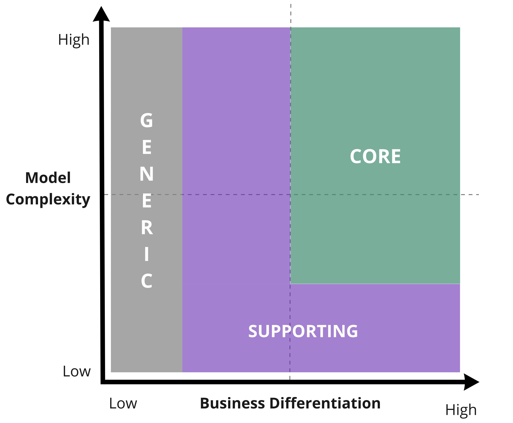
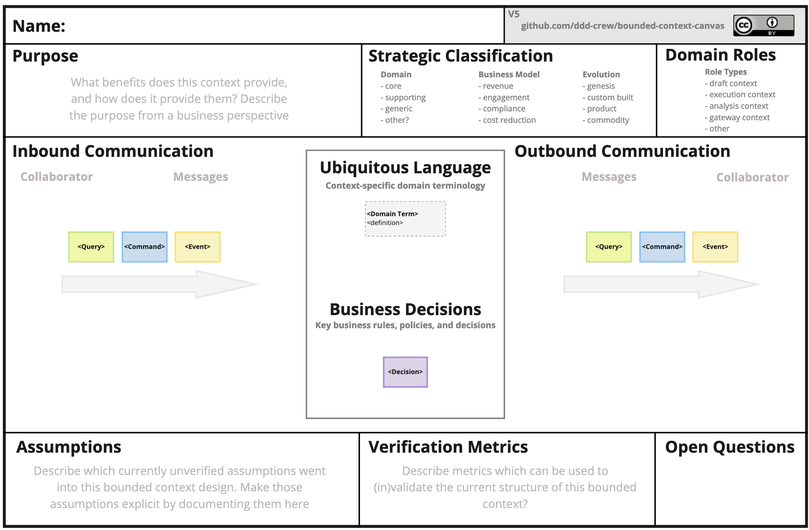

# 도메인 주도 설계 스타터 모델링 과정

이 과정은 조직의 비즈니스 모델을 방향 설정부터 도메인 모델을 코딩하는 것까지 도메인 주도 설계(DDD)의 각 측면을 학습하고 실질적으로 적용하는 단계별 가이드를 제공합니다.

이 프로세스를 통해 DDD 사고방식으로 소프트웨어 시스템을 설계하는 데 필요한 각 필수 단계를 안내받을 수 있으며, 비즈니스 과제에 집중하는 동시에 DDD 학습에 압도되지 않을 수 있습니다.

이 프로세스를 몇 차례 반복하면 DDD 이론의 기초와 실질적인 경험을 통해 DDD에 대해 더 깊이 이해할 수 있으며, 이후에는 어떤 상황에서도 필요에 맞게 프로세스를 조정하고 개선할 수 있게 됩니다. 실제 프로젝트에서는 이 단계들을 오가며 작업하게 되는 경우가 많습니다.

이 프로세스는 초보자를 위한 것입니다. 모범 사례로 표준화해야 할 선형적인 일련의 단계가 아닙니다. 도메인 주도 설계는 지식과 설계의 모든 측면에서 지속적인 반복을 필요로 하는 진화론적인 설계 과정입니다.

 

__목차:__

- [도메인 주도 설계 스타터 모델링 과정](#도메인-주도-설계-스타터-모델링-과정)
  - [DDD 시작 모델링 프로세스를 언제 사용하나요?](#DDD-시작-모델링-프로세스를-언제-사용하나요?)
    - [Greenfield Project 시작 시](#Greenfield-Project-시작-시)
    - [Brownfield Migration 시작 시](#Brownfield-Migration-시작-시)
    - [작업의 주요 프로그램 시작 시](#작업의-주요-프로그램-시작-시)
    - [새로운 학습 기회를 위한 도메인 탐색](#새로운-학습-기회를-위한-도메인-탐색)
    - [프로젝트 현 상태 평가](#프로젝트-현-상태-평가)
    - [팀 재구성](#팀-재구성)
    - [DDD 학습 및 실습](#DDD-학습-및-실습)
  - [프로세스를 어떻게 적용하나요?](#프로세스를-어떻게-적용하나요?)
    - [협업 모델링으로 시작하기](#협업-모델링으로-시작하기)
    - [IT 환경 평가부터 시작하기](#IT-환경-평가부터-시작하기)
    - [아키텍처와 팀 경계를 확정하기 전에 코딩 시작](#아키텍처와-팀-경계를-확정하기-전에-코딩-시작)
    - [7단계(정의)로 넘어가기 전에 2단계(발견)부터 6단계(조직)까지 반복](#7단계(정의)로-넘어가기-전에-2단계(발견)부터-6단계(조직)까지-반복)
    - [컨텍스트 설계 전에 팀 구성](#컨텍스트-설계-전에-팀-구성)
    - [정의와 코딩의 혼합](#정의와-코딩의-혼합)
  - [프로세스](#프로세스)
    - [이해](#이해)
      - [도구](#도구)
      - [참여자](#참여자)
    - [발견](#발견)
      - [도구](#도구-1)
      - [참여자](#참여자-1)
    - [분해](#분해)
      - [도구](#도구-2)
      - [참여자](#참여자-2)
    - [전략 수립](#전략-수립)
      - [도구/리소스](#도구/리소스)
      - [참여자](#참여자-3)
    - [연결](#연결)
      - [도구](#도구-3)
      - [참여자](#참여자-4)
    - [조직](#조직)
      - [도구](#도구-4)
      - [참여자](#참여자-5)
    - [정의](#정의)
      - [도구](#도구-5)
      - [참여자](#참여자-6)
    - [코딩](#코딩)
      - [도구](#도구-6)
      - [참여자](#참여자-7)
    - [DDD 시작 모델링 과정과 whirlpool 프로세스의 연관성](#DDD-시작-모델링-과정과-whirlpool-프로세스의-연관성)
  - [기여자](#기여자)
  - [기여 및 피드백](#기여-및-피드백)

## DDD 시작 모델링 프로세스를 언제 사용하나요?

DDD가 처음이거나 어디서부터 시작해야 할지 잘 모르는 경우, 이 과정은 인지 부하를 줄이는 데 도움이 됩니다. 다음과 같은 시나리오에서 이 프로세스를 따라 진행할 수 있습니다:

### Greenfield Project 시작 시

새 프로젝트를 시작할 때 생각해야 할 것들이 너무 많아 부담될 수 있습니다. 이 프로세스를 한두 번 반복하면 기초를 다지는 데 도움이 됩니다.

### Brownfield Migration 시작 시

레거시 시스템을 현대화하기 전에 이 프로세스를 몇 번 반복하면 목표 아키텍처에 필요한 중요한 정보를 발견하는 데 도움이 됩니다.

### 작업의 주요 프로그램 시작 시

새로운 이니셔티브가 여러 팀에 걸쳐 상당한 투자를 필요로 할 때, 이 과정의 8단계를 모두 다루는 것이 중요합니다. 이 과정은 초기 몇 번의 반복을 안내해줍니다.

### 새로운 학습 기회를 위한 도메인 탐색

소프트웨어 개발은 학습 과정입니다. 새로운 통찰을 발견하거나, 새로운 기회를 식별하거나, 단순히 팀 내 지식을 공유하기 위해 언제든지 DDD 시작 모델링 프로세스를 적용할 수 있습니다.

### 프로젝트 현 상태 평가

이 과정은 현재 시스템이 도메인과 비즈니스 모델에 얼마나 잘 맞춰져 있는지 평가하는 기초가 될 수 있습니다.

### 팀 재구성

느슨하게 결합된 아키텍처는 팀이 병렬 작업 시 차단되지 않도록 합니다. 느슨하게 결합된 아키텍처는 도메인 내 결합과도 일치해야 합니다. 이 과정은 도메인에 맞춘 소프트웨어 아키텍처와 팀 구조를 설계하는 데 도움이 됩니다.

### DDD 학습 및 실습

이 과정은 DDD를 처음 접하거나, 도메인 모델링의 다양한 측면을 다른 사람에게 가르치고 싶을 때 적합합니다. 이 선형적인 과정은 현실적인 프로세스가 아니라는 점을 전달하는 것이 중요합니다. DDD에 자신감이 생길 때까지 인지 부하를 줄이기 위한 출발점일 뿐입니다.

직접 시도해보고 싶다면, SAP에서 당신의 팀에 DDD 모델링 프로세스를 적용하는 방법을 교육하기 위해 [DDD Kata](https://github.com/SAP/curated-resources-for-domain-driven-design/blob/main/ddd-kata.md)를 만들었습니다. 요구사항 집합을 기반으로 이벤트 스토밍, 도메인 메시지 플로우, 바운디드 컨텍스트 캔버스, 어그리거트 캔버스가 어떻게 함께 작동하고 설계 결정을 검증하는 데 도움을 주는지 시도해볼 수 있습니다.

## 프로세스를 어떻게 적용하나요?

이 과정은 여러 가지 방식으로 커스텀할 수 있습니다. 실제 프로젝트에서는 얻거나 얻어야 하는 인사이트를 기반으로 8단계 전체를 전환하게 됩니다.

아래는 순서를 변경하거나 단계 간 전환할 시기를 결정하는 몇 가지 이유입니다.

### 협업 모델링으로 시작하기

팀 전체가 즉시 협업을 시작하기를 원한다면, 익숙한 도메인을 모델링하는 것이 익숙하지 않은 비즈니스 모델과 전략에 대해 이야기하는 것보다 더 편할 수 있습니다.

### IT 환경 평가부터 시작하기

비즈니스 비전을 기대하고 도메인을 깊이 파고들기 전에 기존 아키텍처를 시각화하는 것이 더 나을 수 있습니다. 5단계부터 시작하여 전략적 포트폴리오를 작성해 직면하게 될 주요 제약 사항이 무엇인지 파악하십시오.

### 아키텍처와 팀 경계를 확정하기 전에 코딩 시작

일부 프로젝트에서는 코드를 빨리 작성하는 것이 합리적입니다. MVP를 전달해야 하거나 도메인이 너무 복잡해서 아키텍처를 고려하기 전에 코드로 모델을 만드는 것이 필요할 수도 있습니다.

### 7단계(정의)로 넘어가기 전에 2단계(발견)부터 6단계(조직)까지 반복

개별 바운디드 컨텍스트를 정의하기 전에 도메인을 여러 번 모델링하고 시스템을 하위 도메인 및 팀으로 분해하는 다양한 방법을 모색하는 것이 도움이 될 수 있습니다.

### 컨텍스트 설계 전에 팀 구성

많은 프로젝트에서는 고려해야 할 조직적 제약이 있습니다. 이러한 경우 구현할 수 없는 아키텍처를 설계하기 전에 가능한 팀 구조를 식별하는 것을 고려해야 합니다.

### 정의와 코딩의 혼합

7단계(정의)와 8단계(코딩)는 동시에 발생할 수 있습니다. 이는 바운디드 컨텍스트를 코딩할 때, 그리고 코드 작성에서 얻은 인사이트가 고수준 설계를 변경하게 만드는 경우에 발생할 수 있습니다.

## 과정 설명

모델링 과정은 아래와 같이 8단계로 구성됩니다.

사회기술적 아키텍처를 설계하는 일반적인 단계의 맥락에서 프로세스의 개요를 제공하는 좋은 강연은 [Eduardo da Silva](https://twitter.com/emgsilva)의 ["Sociotechnical Architecture: co-designing technical & organizational architecture to maximize impact"](https://www.youtube.com/watch?v=ekMPm78KFj0&feature=youtu.be&t=1820)입니다. Eduardo는 프로세스 활동과 8단계를 [4가지 개별 단계](https://speakerdeck.com/emgsilva/intro-to-sociotechnical-architecture-co-designing-technical-and-organizational-architecture-to-maximize-impact?slide=31)로 분류합니다. 

1. 정렬 및 이해
2. 전략적 아키텍처
3. 전략 및 조직 설계
4. 전술적 아키텍처

### 이해

조직의 비즈니스 모델, 사용자 요구사항, 단기, 중기 및 장기 목표에 맞춰 초점을 조정합니다.

아키텍처, 코드 또는 조직과 관련된 모든 결정은 비즈니스와 사용자에게 영향을 미칩니다. 소프트웨어 시스템을 가장 효과적으로 설계, 구축, 발전시키기 위해서는 우리의 결정이 최적의 비즈니스 영향을 창출해야 하며, 이는 우리가 비즈니스 목표에 부합하고 사용자의 현재 및 잠재적인 미래 요구를 지원하는 경우에만 달성할 수 있습니다.

잘못 설계된 아키텍처나 경계는 이러한 목표를 달성하는 데 부정적인 영향을 미치거나 불가능하게 만들 수 있습니다.

시작점으로 비즈니스 관점에서는 비즈니스 모델 캔버스(https://www.strategyzer.com/canvas/business-model-canvas)를, 사용자 관점을 이해하는 데는 유저 스토리 매핑(https://www.jpattonassociates.com/user-story-mapping/)을 추천합니다.

#### 도구

- [Impact Mapping](https://www.impactmapping.org/)
- [The Business Model Canvas](https://www.strategyzer.com/canvas/business-model-canvas)
- [The Product Strategy Canvas](https://melissaperri.com/blog/2016/07/14/what-is-good-product-strategy)
- [Wardley Mapping](https://learnwardleymapping.com/)
- [User Story Mapping](https://www.jpattonassociates.com/user-story-mapping/)

#### 참여자

- 소프트웨어를 설계, 구축, 테스트하는 사람들
- 도메인 지식을 가진 사람들
- 제품 및 비즈니스 전략을 이해하는 사람들
- 조직 내 대표 뿐 아니라 실제 엔드 유저

### 발견

도메인을 시각적으로, 그리고 공동으로 탐색하세요.

이것이 DDD의 가장 중요한 측면입니다. 검색을 건너뛸 수 없습니다. 팀 전체가 도메인에 대해 제대로 이해하지 못하면 모든 소프트웨어 결정이 잘못된 방향으로 진행됩니다.

팀 전체에 도메인 지식을 전파하면 공유된 이해가 형성됩니다. 이를 통해 개발자는 도메인에 맞춰 향후 비즈니스 변화를 더욱 유연하게 통합할 수 있는 소프트웨어 시스템을 구축할 수 있습니다. 

도메인 지식이 팀 전체에 분산되도록 하면 구성원이 제품 개선을 위한 아이디어에 기여할 수 있습니다.

> #### 지속적인 검색
>
> DDD를 통해 성공한 팀은 검색 기술을 자주 연습하고 있습니다. 도메인에 대해 배울 내용은 항상 더 많습니다.
>
> 처음 검색을 시도할 때 EventStorming과 같은 기술에 경험이 있는 진행자는 팀이 피상적인 수준을 넘어 발견의 진정한 이점을 볼 수 있도록 도울 수 있습니다.

>
> [Visual Collaboration Tools](https://leanpub.com/visualcollaborationtools)을 확인해보는 걸 강력하게 권합니다.

시작점으로 [EventStorming](https://www.eventstorming.com/)을 추천합니다.

#### 도구

- [Domain Storytelling](https://domainstorytelling.org/)
- [Example Mapping](https://cucumber.io/blog/bdd/example-mapping-introduction/)
- [EventStorming](https://www.eventstorming.com/)
- [User Journey Mapping](https://boagworld.com/audio/customer-journey-mapping/)
- [User Story Mapping](https://www.jpattonassociates.com/user-story-mapping/)

#### 참여자

- 소프트웨어를 설계, 구축, 테스트하는 사람들
- 도메인 지식을 가진 사람들
- 제품 및 비즈니스 전략을 이해하는 사람들
- 소비자의 요구사항과 문제점을 이해하는 사람들
- 실제 엔드 유저

### 분해

도메인을 하위 도메인(도메인의 느슨하게 연결된 부분)으로 분해합니다.

우리는 몇 가지 주요 이유로 대규모 문제 도메인을 하위 도메인으로 분해합니다:

- 인지 부하가 ​​감소하여 영역의 일부에 대해 독립적으로 추론할 수 있습니다.
- 개발 팀에 자율성을 부여하여 솔루션의 개별 부분을 작업할 수 있도록 합니다.
- 소프트웨어 아키텍처와 팀 구조에 적용되는 도메인의 느슨한 결합과 높은 응집력을 식별합니다.

시작점으로 이벤트스토밍을 진행할 때 하위 도메인과 [컨텍스트 맵](https://speakerdeck.com/mploed/visualizing-sociotechnical-architectures-with-context-maps)으로 나누는 게 좋습니다.

*Credit: Alberto Brandolini*

#### 도구

- [Business Capability Modelling](https://www.slideshare.net/trondhr/from-capabilities-to-services-modelling-for-businessit-alignment-v2)
- [Design Heuristics](https://www.dddheuristics.com/)
- [EventStorming with sub-domains](https://www.eventstorming.com/)
- [Independent Service Heuristics](https://github.com/TeamTopologies/Independent-Service-Heuristics)
- [Visualising Sociotechnical Architecture with Context Maps](https://speakerdeck.com/mploed/visualizing-sociotechnical-architectures-with-context-maps)

#### 참여자

- 소프트웨어를 설계, 구축, 테스트하는 사람들
- 도메인 지식을 가진 사람들

### 전략 수립

하위 도메인을 전략적으로 계획하여 핵심 도메인, 즉 비즈니스 차별화 또는 전략적 중요성이 가장 큰 도메인 부분을 식별합니다.

시간과 리소스는 제한되어 있으므로 최적의 비즈니스 효과를 제공하려면 도메인의 어느 부분에 집중해야 하는지 이해하는 것이 중요합니다.

핵심 도메인이 무엇인지 분석함으로써 시스템의 각 부분을 구축하는 데 얼마나 높은 품질과 엄격함이 필요한지 더 잘 알 수 있으며, 고도로 숙련된 구축, 구매, 아웃소싱 결정을 내릴 수 있습니다.

시작점으로 [Core Domain Charts](https://github.com/ddd-crew/core-domain-charts)을 추천합니다.

#### 도구/리소스

- [Core Domain Charts](https://github.com/ddd-crew/core-domain-charts)
- [Purpose Alignment Model](https://www.informit.com/articles/article.aspx?p=1384195&seqNum=2)
- [Wardley Mapping](https://learnwardleymapping.com/)
- [Revisiting the Basics of Domain-Driven Design](https://vladikk.com/2018/01/26/revisiting-the-basics-of-ddd/)

#### 참여자

- 제품 및 비즈니스 전략을 이해하는 사람들
- 소프트웨어를 설계, 구축, 테스트하는 사람들
- 도메인 지식을 가진 사람들

### 연결

엔드투엔드 비즈니스 사용 사례를 충족하는 느슨하게 결합된 아키텍처에 하위 도메인을 연결합니다.

큰 도메인을 여러 부분으로 분해하는 것뿐만 아니라 원치 않는 결합과 복잡성을 최소화하기 위해 해당 부분 간의 상호 작용을 신중하게 설계하는 것도 중요합니다. 숨겨진 복잡성을 찾아내기 위해서는 구체적인 사용 사례를 적용하여 초기 설계에 도전해야 합니다.

시작점으로 [Domain Message Flow Modelling](https://github.com/ddd-crew/domain-message-flow-modelling)을 추천합니다.

#### 도구

- [Business Process Model and Notation](https://en.wikipedia.org/wiki/Business_Process_Model_and_Notation)
- [Domain Message Flow Modelling](https://github.com/ddd-crew/domain-message-flow-modelling)
- [Process Modelling EventStorming](https://www.eventstorming.com/)
- [Sequence Diagrams](https://en.wikipedia.org/wiki/Sequence_diagram)

#### 참여자

- 소프트웨어를 설계, 구축, 테스트하는 사람들
- 도메인 지식을 가진 사람들

### 조직

빠른 흐름에 최적화되고 컨텍스트 경계에 맞춰 조정되는 자율 팀을 구성합니다.

팀은 자율성, 명확한 목표, 목적의식을 갖도록 조직되어야 합니다. 그러기 위해서는 조직의 제약을 고려하여 팀이 빠른 흐름을 위해 스스로 조직할 수 있도록 해야 합니다. 

> #### 스스로 팀 구성하기
>
> 조직은 팀에 의해 수행되는 것이 아니라 팀이 경계, 상호 작용 및 책임을 정의하는 프로세스에 참여해야 합니다.
>
> Red Gate Software와 같은 일부 회사에서는 팀이 [스스로 완전히 조직화](https://medium.com/ingeniouslysimple/how-redgate-ran-its-first-team-self-selection-process-4bfac721ae2)할 수 있도록 권한을 부여하고 신뢰합니다.

팀을 컨텍스트 경계에 맞추면 사람들이 서로 협력하는 방식을 최적화할 수 있습니다. 팀 규모를 적절하게 조정하려면 가용 인재, 인지 부하, 커뮤니케이션 오버헤드 및 버스 요소를 고려해야 합니다.

시작점으로 [컨텍스트 맵](https://speakerdeck.com/mploed/visualizing-sociotechnical-architectures-with-context-maps)을 사용하여 사회기술적 아키텍처를 시각화하는 것을 추천합니다. 가장 중요한 패턴에 대한 간략한 개요는[context-mapping](https://github.com/ddd-crew/context-mapping) GitHub 프로젝트에서 확인할 수 있습니다.

*Credit: Michael Plöd*

#### 도구

- [Dynamic Reteaming](https://leanpub.com/dynamicreteaming) 
- [Pioneers, Settlers & Town Planners](http://wardleypedia.org/mediawiki/index.php/Pioneers_settlers_town_planners)
- [Team Topologies](https://teamtopologies.com/)
- [Visualising Sociotechnical Architecture with Context Maps](https://speakerdeck.com/mploed/visualizing-sociotechnical-architectures-with-context-maps)

#### 참여자

- 소프트웨어를 설계, 구축, 테스트하는 사람들
- 도메인 지식을 가진 사람들
- 제품 및 비즈니스 전략을 이해하는 사람들

### 정의

각 [바운디드 컨텍스트](https://martinfowler.com/bliki/BoundedContext.html)의 역할과 책임을 정의합니다.

디자인을 결정하기 전에 전체 설계에 큰 영향을 미칠 수 있는 선택 사항에 대해 명시적인 결정을 내립니다. 이러한 대화는 마음을 바꾸고 대체 모델을 탐색하기 쉬울 때 이루어져야 합니다.

시각적으로 협력하여 설계하고 제약이나 기회를 발견할 수 있도록 기술적 한계를 고려하세요.

시작점으로 [Bounded Context Canvas](https://github.com/ddd-crew/bounded-context-canvas)를 추천합니다.

#### 도구

- [Bounded Context Canvas](https://github.com/ddd-crew/bounded-context-canvas)
- [C4 System Context Diagram](https://c4model.com/#SystemContextDiagram)
- [Quality Storming](https://speakerdeck.com/mploed/quality-storming)

#### 참여자

- 소프트웨어를 설계, 구축, 테스트하는 사람들
- 도메인 지식을 가진 사람들
- 제품 책임자

### 코딩

도메인 모델을 코딩합니다.

코드를 도메인에 맞춰 정렬하면 도메인이 변경될 때 코드를 더 쉽게 변경할 수 있습니다. 전문가와 함께 문제 공간을 공동으로 모델링함으로써 개발자는 해당 도메인에 대해 배우고 오해를 최소화할 수 있는 기회를 갖게 됩니다.

시작점으로 [Aggregate Design Canvas](https://github.com/ddd-crew/aggregate-design-canvas)를 추천합니다.

#### 도구

- [Aggregate Design Canvas](https://github.com/ddd-crew/aggregate-design-canvas)
- [C4 Component Diagrams](https://c4model.com/#ComponentDiagram)
- [Design-Level EventStorming](https://www.eventstorming.com/)
- [Event Modeling](https://eventmodeling.org/posts/what-is-event-modeling/)
- [Hexagonal Architecture](https://en.wikipedia.org/wiki/Hexagonal_architecture_(software))
- [Mob Programming](https://mobprogramming.org/)
- [Model Exploration Whirlpool](https://domainlanguage.com/ddd/whirlpool/)
- [Onion Architecture](https://jeffreypalermo.com/2008/07/the-onion-architecture-part-1/)
- [Unified Modelling Language](https://en.wikipedia.org/wiki/Unified_Modeling_Language)

#### 참여자

- 소프트웨어를 설계, 구축, 테스트하는 사람들

### DDD 스타터 모델링 프로세스와 whirlpool 프로세스의 관계  
  
여러분 중 일부는 Eric Evans의 [Whirlpool 프로세스](https://www.domainlanguage.com/ddd/whirlpool/)와 몇 가지 유사점을 발견했을 것입니다. 실제로 둘 다 지침일 뿐 엄격한 모범 사례는 아닙니다. 또한 지속적이고 반복적입니다.  
그러나 DDD 스타터 모델링 프로세스는 사회 기술 아키텍처 구축을 목표로 하여 Whirlpool 프로세스보다 더 많은 것을 다루고 있습니다.  
아래 그림은 두 프로세스 간에 가능한 공통점을 보여줍니다.

  

Eric Evan의 Whirlpool 프로세스는 오늘날에도 완전히 유효하며 사람들에게 모델 탐색 방법에 대한 매우 귀중한 통찰력과 지침을 제공합니다.

## 기여자

모든 [기존 및 향후 기여자](https://github.com/ddd-crew/ddd-starter-modelling-process/graphs/contributors)와 DDD 스타터 모델링 프로세스에 기여한 이들에게 감사드립니다:

- [Ciaran McNulty](https://github.com/ciaranmcnulty)
- [Eduardo da Silva](https://github.com/emgsilva)
- [Gien Verschatse](https://twitter.com/selketjah)
- [James Morcom](https://twitter.com/morcs)
- [Maxime Sanglan-Charlier](https://twitter.com/__MaxS__)

## 기여 및 피드백

도메인 중심 설계 스타터 모델링 프로세스는 무료로 사용할 수 있습니다. 또한 기술을 개선하거나 대체 버전을 만드는 데 필요한 피드백과 아이디어를 환영합니다.

질문이 있는 경우 당사에 문의하거나  [Issue](https://github.com/ddd-crew/ddd-starter-modelling-process/issues/new/choose)에 등록할 수 있습니다.

언제든 편하게 [case studies](/case-studies)와 함께 pull request를 보내주시기 바랍니다.

[![CC BY 4.0][cc-by-shield]][cc-by]

이 저작물은 [Creative Commons Attribution 4.0 International License][cc-by]에 따라 라이센스가 부여됩니다.

[![CC BY 4.0][cc-by-image]][cc-by]

[cc-by]: http://creativecommons.org/licenses/by/4.0/
[cc-by-image]: https://i.creativecommons.org/l/by/4.0/88x31.png
[cc-by-shield]: https://img.shields.io/badge/License-CC%20BY%204.0-lightgrey.svg
